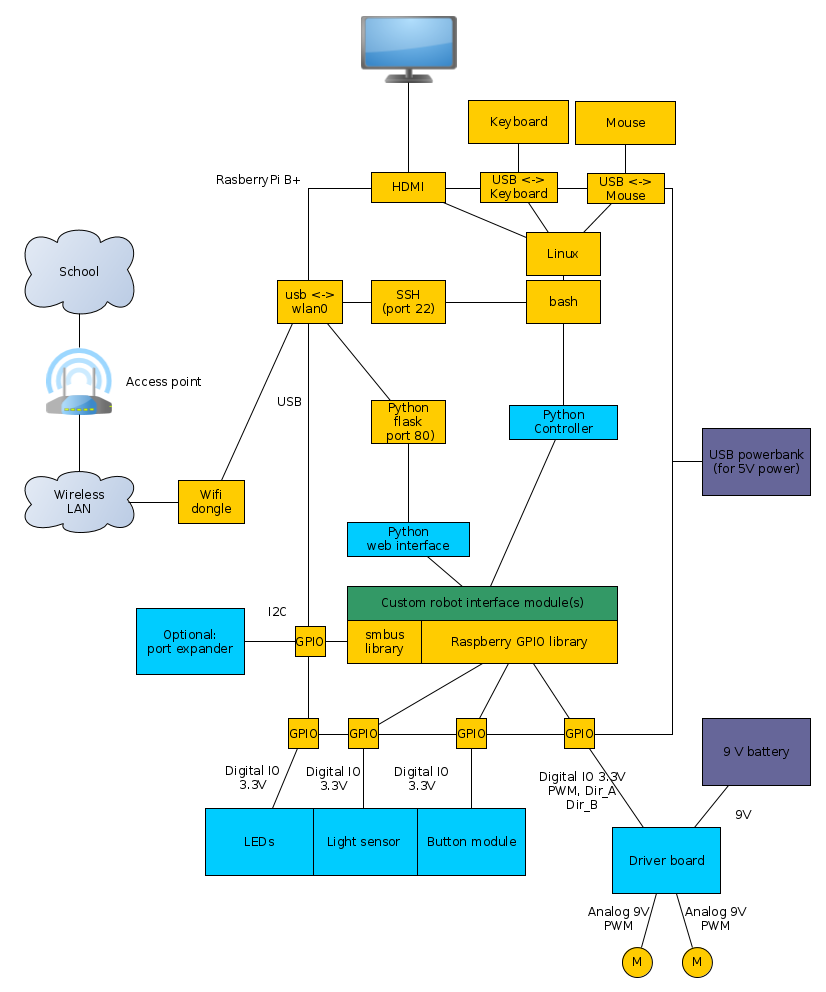

# Introduction

The introductory project for first semester IT technology is designed to give the student the opportunity to work with the ideas, methods and technology that will be used during the education. 
One goal for the project is for the student to know if this education for for them and if so, which specialization that appeals to them.
The technical goal for the project is to create a robot system, that is able to follow a line or other guides. The specific will be decided later.

# Network overview

The main part of the system is the raspberry pi. It is a simple ARM-based computer running Linux. 

The basic design for the entire system is as follows

(source file available [here](Blockdiagram.graphml))

To interface to the raspberry, there are two options. The first is to use a keyboard and a monitor, and the second is to connect remotely using SSH.

The raspberry will connect to a dedicated LAN set up for that specific purpose. This enables the option of using host names instead of only IP addresses.
On the inside of the raspberry pi, Linux is running. There will be libraries available to interface to external devices and to build a rudimentary web interface1.
The student will write their own programs to improve the web interface a the command line control script.

For the robot to function, the raspberry will use the digital IO ports to control and read a light sensor, a button module and a driver board. Some of these schematics will be available beforehand.
Optionally, it will be possible to create a board with a port expander which, through I2C, is able to control more digital IO ports.

# Performance

No special perfomance requirements.

# Hardware

For each group

* raspberry w. wifi dongle , powersupply and USB cable
* robot
* monitor, keyboard, hdmi<->vga adapter
* wires
* driver board
* 1 LED sensor board
* Contact sensor board
* Optional: port expander

In general

* Router/AP to connect to and to server DHCP (both cabled and DHCP)
* Ethernet cables for debugging

#  Protocols and standards

## Wireless LAN - 802.11b/g/n

Wifi, or 802.11 b/g/n/ac is a standard for wireless communication as defined by IEEE. 
See http://standards.ieee.org/about/get/802/802.11.html 

This is the common wireless standard usable by most wireless laptops, smartphones and such.

## I2C

I2C is a simple master/slave serial bus. It is widely used for inter-chip communication at low speeds. 
See http://i2c.info/i2c-bus-specification 

# IP layout and VLAN layout

The class network as served by the router/AP.

* ip range 192.168.1.0/24
* gateway 192.168.1.1
* DNS 192.168.1.1
* DHCP will serve 192.168.1.50-250

VLANs are not used.

# Naming convention

Raspberries will be called Raspberry01, Raspberry02, and so on, where the number reflects the group number. This is the name that will appear in the dhcp lease file in the router/AP.

Other names are decided by e.g. kernel drivers.
