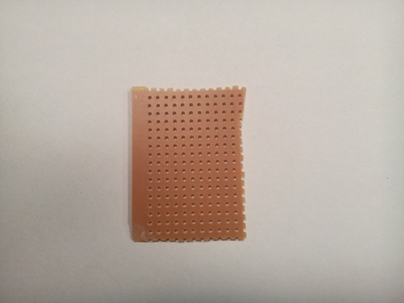
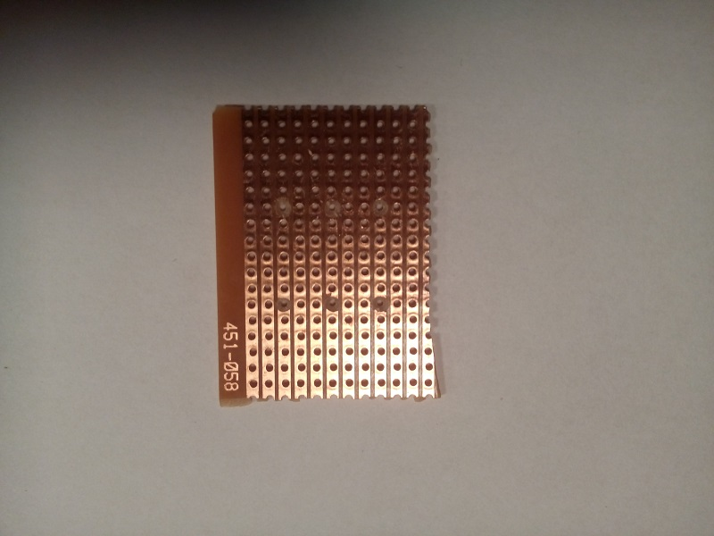
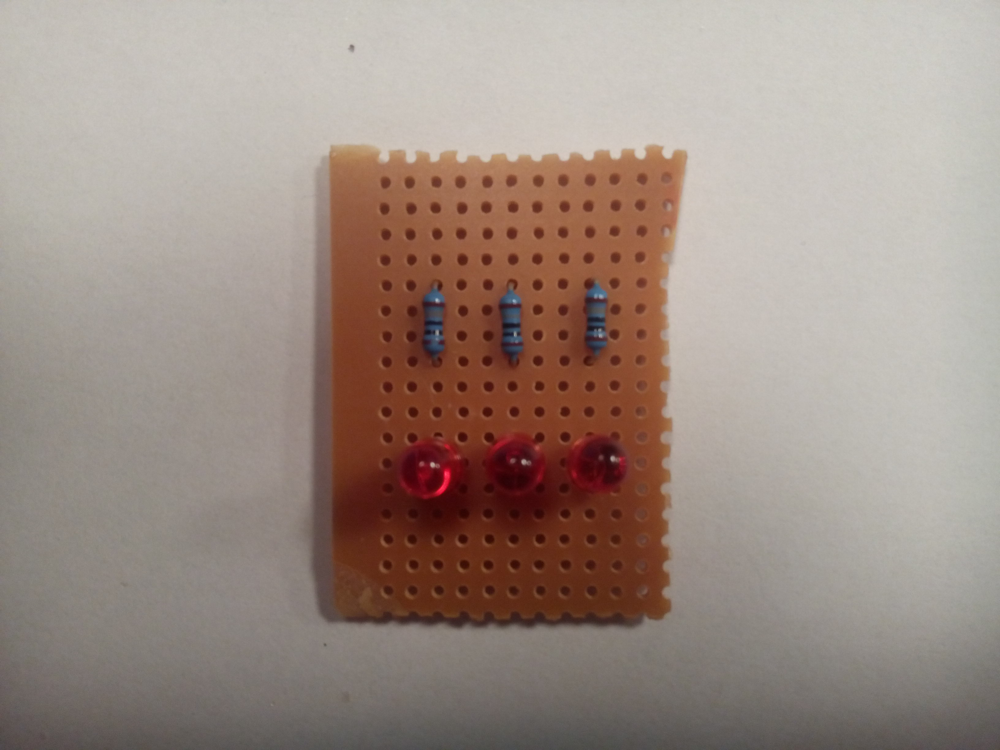
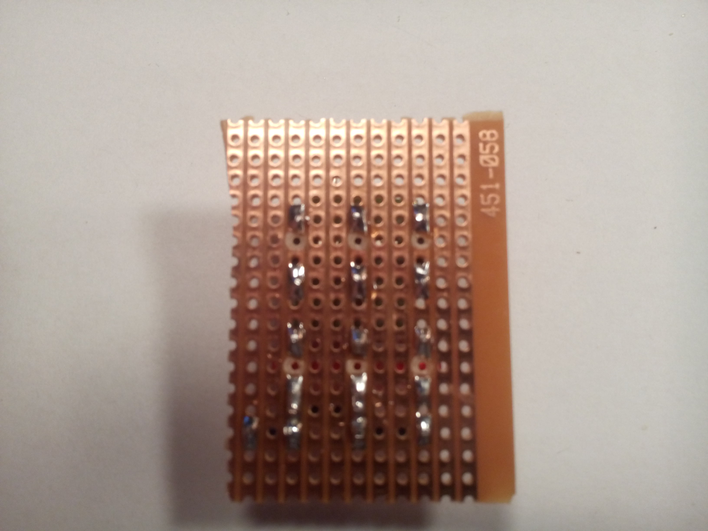
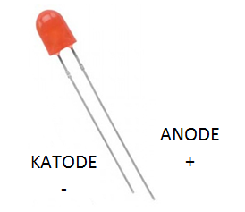

This page describes, with text and pictures, the LED pad which is useful for testing the GPIO pins of the Raspberry Pi. The GPIO pins are controlled by a Python script, and the LEDs can be used to visualize the state of the controlled GPIO pins for testing and error finding.  

The LED pad consists of the following components:

* 180 &Omega;
* Light Emitting Diode (LED). Color and size of own choise, but use either red, green or yellow.
* A piece of veroboard
* Wires
* Connectors and heat-shrink tubing

The schematic of the LED pad is illustrated to the left below. Note, that additional LEDs can be connected in parallel as illustrated in the picture to the right. This is useful for testing more than one GPIO from the Raspberry Pi.

| Single LED        |   | Three LEDs in parallel |
|:-----------------:|---|:----------------------:|
|![Single LED][Sch_Single]|   |![Parallel LEDs][Sch_Parallel]|

[Sch_Single]: pics/LED_Circuit_Simple.png "Single LED"
[Sch_Parallel]: pics/LED_Circuit_Many_LEDs.png "LEDs mounted in parallel"

This following guide describes a circuit with three LEDs, but the circuit can easily be extented with more LEDs.

### Veroboard
__First__, cut a piece of veroboard. The size of the veroboard is not crusial, just make sure there is enought space for the wanted number of LEDs. The pictures shows a veroboard of size 17x11 holes. 

| Veroboard from front | Veroboard seen from the back|
|:--------------------:|:---------------------------:|
|| |

It is important to remove the cobber stribes between the pins of the resistor(s) and the LED(s) as illustrated on the image to the right.

### Mounting the components
__Second__, Mount the components as illustrated on the pictures below. Solder the pins to the veroboard.

| Component side of the veroboard | Soldering side of the veroboard |
|:-------------------------------:|:-------------------------------:|
|| |

`__NOTE__ The LED shall be properly oriented. The long connector is anode (+) and short connector is catode (-). Mount the long connector of the LED to the resistor. The other side of the resistor will be attached to the GPIO pin of the Raspberry Pi. 
The resistor cannot be mounted wrong.
`

