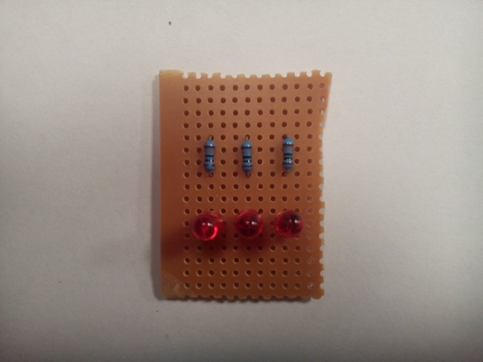
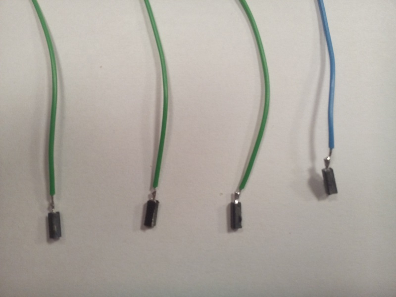
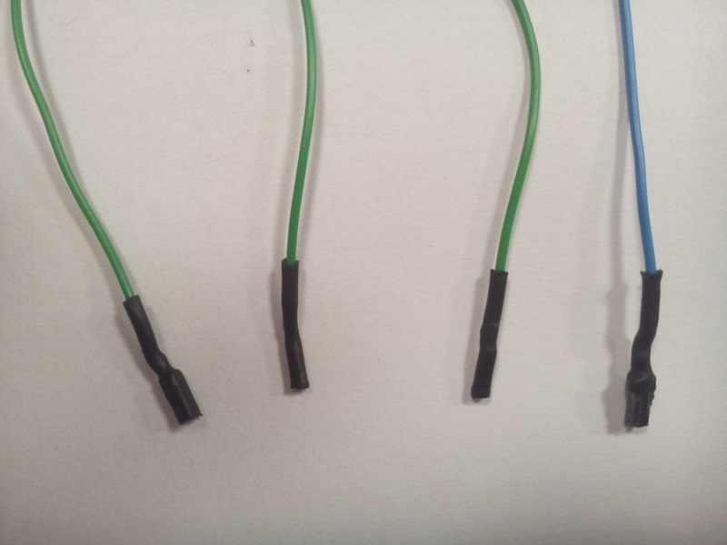

This page describes, with text and pictures, the LED pad which is useful for testing the GPIO pins of the Raspberry Pi. The GPIO pins are controlled by a Python script, and the LEDs can be used to visualize the state of the controlled GPIO pins for testing and error finding.  

The LED pad consists of the following components:

* 180 &Omega;
* Light Emitting Diode (LED). Color and size of own choise, but use either red, green or yellow.
* A piece of veroboard
* Wires
* Connectors and heat-shrink tubing

The schematic of the LED pad is illustrated to the left below. Note, that additional LEDs can be connected in parallel as illustrated in the picture to the right. This is useful for testing more than one GPIO from the Raspberry Pi.

| Single LED        |   | Three LEDs in parallel |
|:-----------------:|---|:----------------------:|
|![Single LED][Sch_Single]|   |![Parallel LEDs][Sch_Parallel]|

[Sch_Single]: pics/LED_Circuit_Simple.png "Single LED"
[Sch_Parallel]: pics/LED_Circuit_Many_LEDs.png "LEDs mounted in parallel"

This following guide describes a circuit with three LEDs, but the circuit can easily be extented with more LEDs.

### Veroboard
__First__, cut a piece of veroboard. The size of the veroboard is not crusial, just make sure there is enought space for the wanted number of LEDs. The pictures shows a veroboard of size 17x11 holes. 

| Veroboard from front | Veroboard seen from the back|
|:--------------------:|:---------------------------:|
|| |

It is important to remove the cobber stribes between the pins of the resistor(s) and the LED(s) as illustrated on the image to the right.

### Mounting the components
__Second__, Mount the components as illustrated on the pictures below. Solder the pins to the veroboard.

| Component side of the veroboard | Soldering side of the veroboard |
|:-------------------------------:|:-------------------------------:|
|| |

__NOTE: The LED shall be properly oriented. The long connector is anode (+) and short connector is catode (-). Mount the long connector of the LED to the resistor. The other side of the resistor will be attached to the GPIO pin of the Raspberry Pi. The resistor cannot be mounted wrong.__

Mount wires between the catode (-) of all the LEDs as illustrated on the picture below. The catode (or minus) will be common for the LEDs, which is also illustrated in the schematic on top of the page.

### Wires
__Third__, prepare wires to be mounted on the veroboard. Solder connectors to the wires. Make the wires extra safe by covering the connectors by heat-srinking tubes for protecting the Raspberry Pi against short circuits etc. See illustrations below.

| Prepare four wires for the LED pad | Connectors covered with head-shrinking tube |
|:-------------------------------:|:-------------------------------:|
|| |

Mount the four wires on the veroboard to the copper lanes with the resistors and the copperlane with the common catode (-) of the LEDs. 

### The result
The LED pad look should similar to the picture below. Each LED can be tested by attaching the wire connected to the common catode (-) (blue wire on the picture) to minus on a power supply (or battery), and the wires from the resistors (green wires on the picture) to plus on a power supply (or battery). Use either a powersupply adjusted to approx 3.3V or two 1.5V batteries connected in series, for testing.

### Connecting to the Raspberry Pi 
__Forth__, connect the LED pad to the Raspberry Pi. Attach the wire from the common connected LED copper lane (-) to GND on the RPi (Lookup the pinout on the Internet). Connect each of the wires to any GPIO on the Raspberry Pi (again, lookup the RPi pinout on the Internet). Modify and run the testprogram and see if the LEDs light up as expected. 

| The LED pad connected to the Raspberry Pi | Let there be light! |
|:-------------------------------:|:-------------------------------:|
|| |

### If the LED pad is not working
* Are the LEDs orientated correctly? 
* Are the LEDs and resistors mounted properly as described in the schematic.
* Compare the result with the pictures.
* Check the LEDs with a battery / powersupply.
* Any short-circuits?
* Is the LED pad connected to the right Raspberry Pi pins.
* Check the pins used in the Python script.
* Ask your classmates for help.
* ... 
