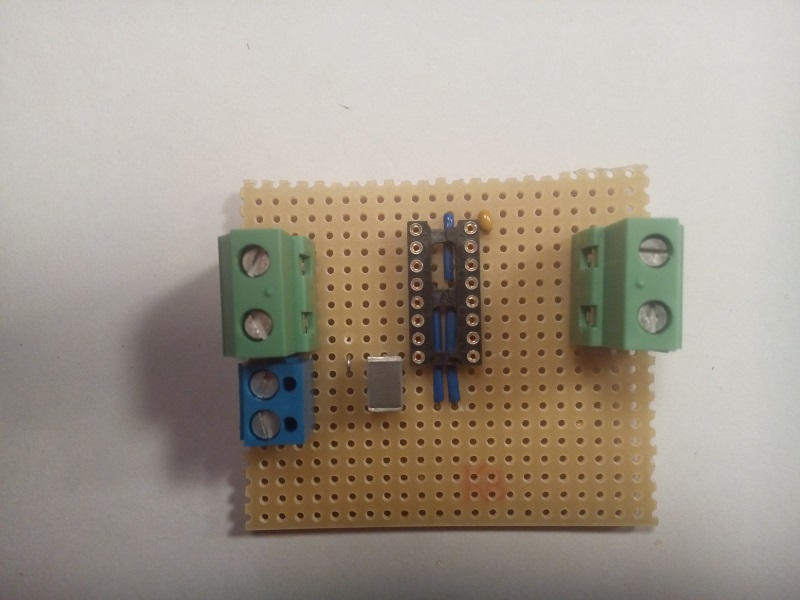
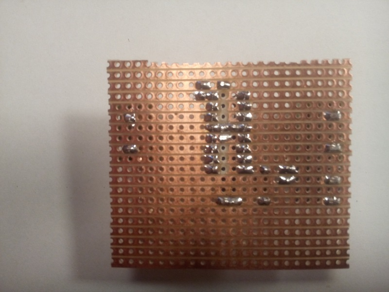
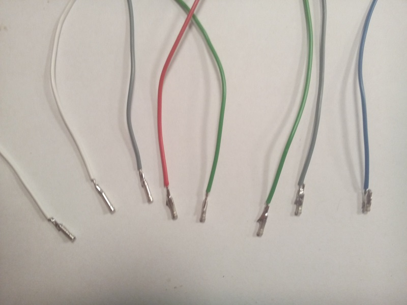
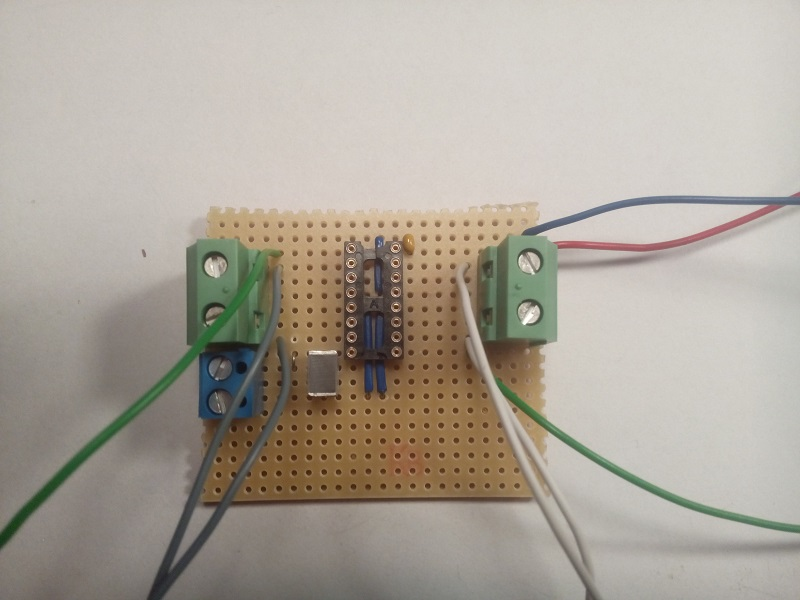
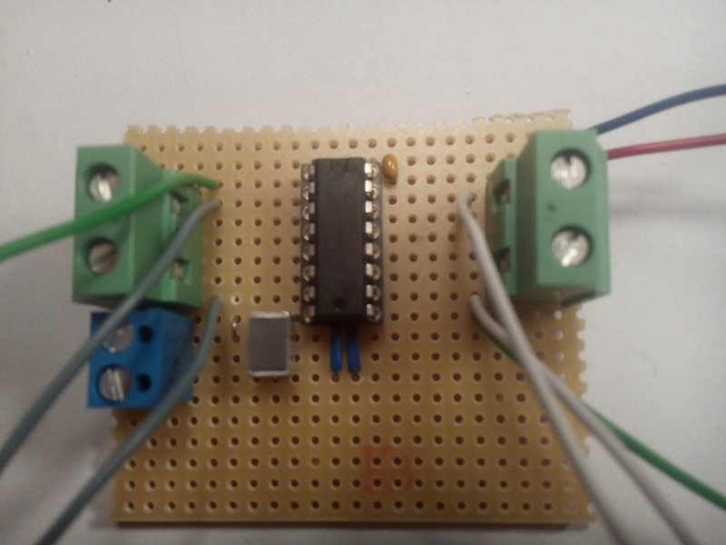
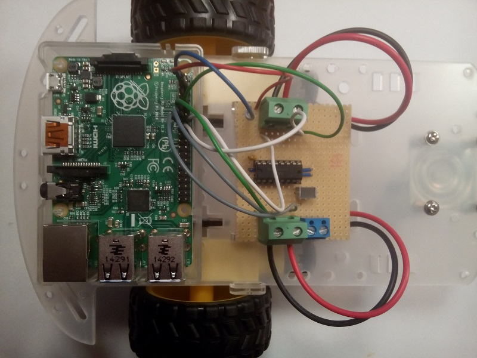

This page describes, with text and pictures, the motor driver board, used for powering the two motors on the robot. The motor driver board is controlled by the Raspberry Pi. The direction of the motors can be controlled, and speed can be controlled by using a PWM signal.

## Components
* 16 pin DIL IC socket
* 1 &mu;F capacitor (or bigger - size not that important)
* 100 nF capacitor
* 2 terminal blocks with 7,5mm spacing (green)
* 1 terminal block with 3.5mm spacing (blue)
* 1 L293D motor driver IC
* Various wires and connectors and heat-shrinking tube.

It is a good idea to build and solder the [LED pad](../LEDpad) before building the motor driver board.

## The circuit
The circuit consists primary of the L293d motor driver ic, connected with the terminal blocks and a few decoupling capacitors. The L293d motordriver chip pinout is outlined in the picture below.

Always start counting the pin numbers on a DIL chip from the top left side on the chip, next to the notch. 

- Pin 1: Pin used for enabling/disabling the motor connected to the left side of the chip. The pin can also be used for speed controlling the motor by using PWM.
- Pin 2: Logic signal, from the RPi, for controlling the left motor.
- Pin 3: Power signal to the left motor.
- Pin 4, 5: Ground and heatsink for the chip
- Pin 6: Power signal to the left motor.
- Pin 7: Logic signal, from the RPi, for controlling the left motor
- Pin 8: Power supply used to the motors (motors can handle 5V - 12V)
- Pin 9: Pin used for enabling/disabling the motor connected to the right side og the chip. The pin can also be used for speed controlling the motor by using PWM.
- Pin 10: Logic signal, from the RPi, for controlling the right motor.
- Pin 11: Power signal to the right motor.
- Pin 12, 13: Ground and heatsink for the chip.
- Pin 14: Power signal to the right motor.
- Pin 15: Logic signal, from the RPi, for controlling the right motor. 
- Pin 16: Power supply to power the logic inside the chip. Use **max 5V** which can be supplied from the RPi.

The motor will turn in one direction, when the RPi signal is e.g. HIGH on pin 2 while pin 7 is LOW. The motor turns in the opporsite direction when pin state is reversed. Note that the enable pin has to be HIGH in order to drive the motors.

## Veroboard
Cut a piece of veroboard. Size is not that important, but make sure theres ok space on the board. The veroboard on the right picture below has approx 22x19 holes. Initially, six copper circuits has to be cut below the motor driver chip as outlined on the left picture below. Use a drill or a sharp knife to cut the copper circuits. The two pins in the middle of the "chip" can be left uncutted, as those pins and the copper circuits works as a heat-sink and commond ground (-) for the chip.

| The used veroboard | The back of the veroboard |
|:------------------:|:-------------------------:|
|||

## Mounting the components
Start planning the placement of the components and wires on the veroboard before soldering. Three wires are used to connect ground (-) to some of the other copper circuits as illustrated on the pictures below. 

| Wires added to the veroboard | The back of the veroboard |
|:------------------:|:-------------------------:|
|||

Mount the small components afterwords, like the IC socket an and the two capacitors. The 1 &mu;F capacitor is located in the lower left next to the socket. The 100 nF capacitor is located on top, right next to the socket. The capacitors are mounted between the VCC on the two power supplies to GND, and works are a local energy storage. 

Make sure to orientate the IC socket with the notch correctly. 

| Small components added | The back of the veroboard |
|:------------------:|:-------------------------:|
|||

Please note, the little connection that is made between pin 8 to the copper circuit just below the socket. This is necessary to get the terminals mounted nicely afterwords.

Mount the three terminals, used for the motor power supply and the output to the motors. Make sure that the terminals are mounted as follows:

&nbsp;&nbsp;Motor 1: Pin nr. 3 and 6 to one (green) terminal.

&nbsp;&nbsp;Motor 2: Pin nr. 11 and 14 to one (green) terminal.

&nbsp;&nbsp;Motor power supply to a (blue) terminal connected between pin 8 and GND (ground or minus). The little connection described above is used to connect VCC of the motor power supply to the (blue) terminal.

| The veroboard after all components are mounted | The back of the veroboard |
|:----------------------------------------------:|:-------------------------:|
|||

## The wires
The motor driver circuit is attached to the Raspberry Pi by using **eight** wires. These wires are used for controlling each motors, which requires three wires pr motor. Tthe last two wires are used to power the logic inside the motordriver IC. 

Prepare eight wires with connectors and heat-shrinking tubes. The color of the wires are not that important, but chose the colors of the wires so it is easy to remember the wires purpose. For example, use grey wire for the left motor, white wire for the right motor, green wire for the enable pins and red/black wires for the logic power supply. Heat-shrinking tube is used to avoid short circuits.

| Eight wires with connectors | The wires with heat-shrinking tube |
|:---------------------------:|:----------------------------------:|
|||

Solder the eight wires to the motor driver board.

&nbsp;&nbsp;Solder wires of the same color to the enable pins (1 and 9) on the motor driver board. 
&nbsp;&nbsp;Solder wires of the same color to the logic pins that controls motor 1 (pin 2 and 7). 
&nbsp;&nbsp;Solder wires of the same color to the logic pins that controls motor 2 (pin 2 and 7). 
&nbsp;&nbsp;Solder red wire to pin 16 (VCC for logic) and black wire to ground (either pin 4,5,12 or 13).

## Test the circuit
The circuit is almost done. Visual inspect the circuit for short circuits. Use a multimeter to test the connections between the wires and the corrosponding pins on the socket and terminals and to test for short circuits.

## The finished circuit 
When the circuit is checked and tested, attach the motor driver IC in the socket on the board. The board is now ready to be attached to the GPIOs on the Raspberry Pi.  

| The board without the IC mounted | Motor driver board with the IC mounted|
|:-----------------------------:|:----------------------------------------:|
|||

The board is now ready to be mounted on the robot frame. Drill some holes in the motor driver board, to ease mounting on the robot frame. But take care of makeing new short circuits! 

## Connecting the motordriver to the Raspberry Pi
It is important to attach the motordriver board correct to the Raspberry Pi.
