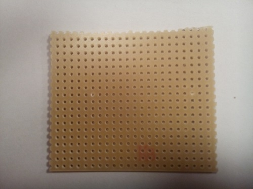

This page describes, with text and pictures, the motor driver board, used for powering the two motors on the robot. The motor driver board is controlled by the Raspberry Pi. The direction of the motors can be controlled, and speed can be controlled by using a PWM signal.

## Components
* 16 pin DIL IC socket
* 1 &mu;F capacitor (or bigger - size not that important)
* 100 nF capacitor
* 2 terminal blocks with 7,5mm spacing (green)
* 1 terminal block with 3.5mm spacing (blue)
* 1 L293D motor driver IC
* Various wires and connectors

It is a good idea to build and solder the [LED pad](../LEDpad) before building the motor driver board.

## The circuit
The circuit consists primary of the L293d motor driver ic, connected with the terminal blocks and a few decoupling capacitors. The L293d motordriver chip pinout is outlined in the picture below.

Always start counting the pin numbers on a DIL chip from the top left side on the chip, next to the notch. 

- Pin 1: Pin used for enabling/disabling the motor connected to the left side of the chip. The pin can also be used for speed controlling the motor by using PWM.
- Pin 2: Logic signal, from the RPi, for controlling the left motor.
- Pin 3: Power signal to the left motor.
- Pin 4, 5: Ground and heatsink for the chip
- Pin 6: Power signal to the left motor.
- Pin 7: Logic signal, from the RPi, for controlling the left motor
- Pin 8: Power supply used to the motors (from 5V - 12V)
- Pin 9: Pin used for enabling/disabling the motor connected to the right side og the chip. The pin can also be used for speed controlling the motor by using PWM.
- Pin 10: Logic signal, from the RPi, for controlling the right motor.
- Pin 11: Power signal to the right motor.
- Pin 12, 13: Ground and heatsink for the chip.
- Pin 14: Power signal to the right motor.
- Pin 15: Logic signal, from the RPi, for controlling the right motor. 
- Pin 16: Power supply to the logic inside the chip. _Max 5V_** Can be powered from the RPi.

The motor will turn in one direction, when the RPi signal is e.g. HIGH on pin 2 while pin 7 is LOW. The motor turns in the opporsite direction when pin state is reversed. Note that the enable pin has to be HIGH in order to drive the motors.

## Veroboard
Cut a piece of veroboard. Size is not that important, but make sure theres ok space on the board. The veroboard on the right picture below has approx 22x19 holes. Initially, six copper lanes has to be cut below the motor driver chip as outlined on the left picture below. The two pins in the middle of the "chip" can be left uncutted, as those pins and the copper lanes works as a heat-sink and commond ground (-) for the chip.

| The used veroboard | The back of the veroboard |
|:------------------:|:-------------------------:|
|||

## Mounting the 
