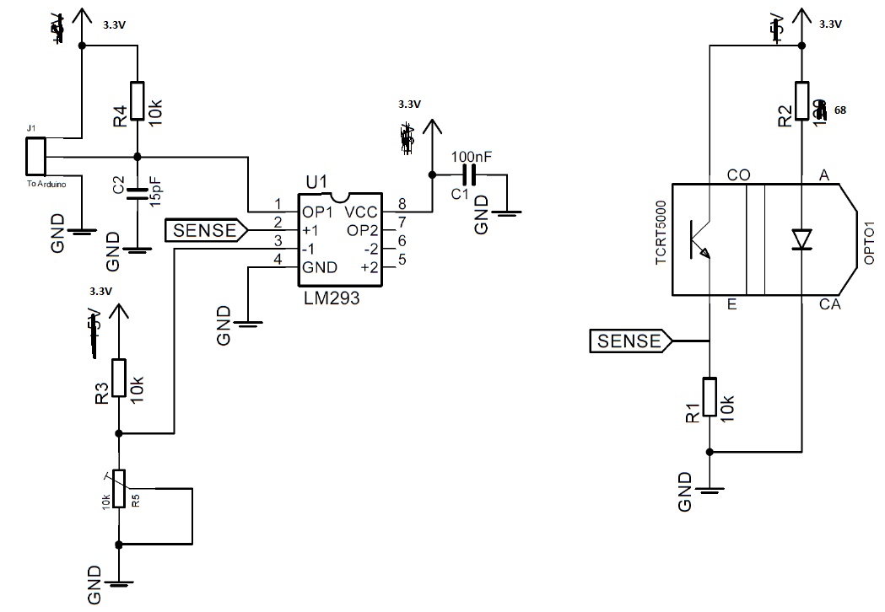

## The circuit

The sensor circuit can either be build on a piece of veroboard or on a milled PCB.  

The components needed:
* 10k&Omega resistor (x3)
* 68&Omega resistor (Please note, that this resistor replaces the 120&Omega resistor on the schematic).
* 10k&Omega trimresistor (The blue resistor with the screw terminal)
* 100 nF capacitor
* 15 pF capacitor
* TCRT5000 lightsensor
* 8 pin IC socket 
* LM293 operation comparator

The schematic of the sensor circuit. If You chose to build the circuit on veroboard, remember to be very precise regarding connection between the different components. Please note the adjustments on the schematic.

The PCB handed out is outlined in the images below. Remember to face the PCB right before start soldering.

| PCB from component side | Backside of the PCB |
|:--------------------:|:---------------------------:|
|| 

Be careful to mount the components right and in the right places. The result should look like the picture below.

How to mount the components on the PCB is outlined below. Note that blue lines means buttom layer. 
| Component placement with wires | Component placements as the PCB looks|
|:--------------------:|:---------------------------:|
|| 

Note that three vias, connections between top and buttom layer, has to be added to the PCB as indicated below.

Test the built PCB by using the microscope and multimeter before attaching power to the circuit. After attaching power, measure whether output turns high or low when the sensor is placed below either a black or white surface.
